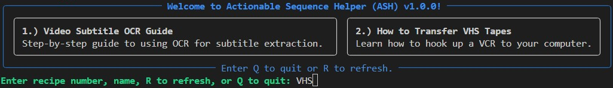

# Actionable Sequence Helper (ASH) v1.1

ASH is a flexible, command-line tool designed to guide users through a series of steps defined in "recipes." It's perfect for standardizing complex workflows, creating interactive checklists, or automating multi-step processes that require user input or actions at specific points.

## Interactive Menu


## Features

*   **Recipe-Driven Workflow**: Define a sequence of steps in simple JSON files.
*   **Custom Step Display**: Each step can have unique title to help user understand step purpose.
*   **Interactive Steps**: Recipes can be simple checklists or can execute custom Python code.
*   **Dynamic Code Loading**: Automatically loads and runs functions from a Python file associated with your recipe.
*   **User-Friendly Interface**: Built with `rich` for a clean, modern terminal experience.
*   **GUI Integration**: Provides a safe, built-in helper to launch GUI dialogs (like file pickers) from your recipes.
*   **Recipe Context**: Share data between steps using the built-in `recipe_context` system.
*   **Version Management**: Automatic upgrades from legacy formats with backup preservation.
*   **Enhanced Error Handling**: Detailed error reporting with file names and line numbers.

## Getting Started

### Quick Installation

See [INSTALL.md](INSTALL.md) for detailed installation instructions.

### Try the Examples

Before creating your own recipes, check out the comprehensive examples in the `examples/` folder:

```bash
# Copy the example to your recipes folder
cp examples/example.* recipes/
python ash_menu.py
```

The example recipe demonstrates all major ASH features including user prompts, file dialogs, error handling, and rich formatting.

### Running ASH

To run the application, simply execute the `ash_menu.py` script from your terminal:

```bash
python ash_menu.py
```

This will display a menu of all available recipes found in the `recipes/` directory.

## How It Works: The Recipe System

ASH is built around the concept of **recipes**. A recipe consists of two parts:

1.  **A JSON file (`.json`)**: This is the core of the recipe. It defines the sequence of steps, including the instructions to show the user and (optionally) the name of a Python function to run.
2.  **A Python file (`.py`)**: This file is **optional**. It contains the actual Python functions that are called by the recipe steps. If a recipe is just a simple checklist, you don't need a `.py` file.

When you select a recipe from the menu, the execution engine reads the JSON file and proceeds step-by-step, displaying the instructions and executing any associated code.

## Creating Your Own Recipes

To create a new recipe, you'll typically create two files in the `recipes/` directory: `my_recipe.json` and `my_recipe.py`.

### The Recipe JSON File (`my_recipe.json`)

The JSON file uses the modern v1.1 flat format. Simply add your title, description, and step properties directly to the object.

**Key fields for a recipe:**
*   `version`: Always set to "1.1" for the current format
*   `title`: The recipe name displayed in the menu
*   `description`: Brief description of what the recipe does
*   `color` (optional): A color name (e.g., "blue"), hex code, or "rainbow" to style the menu panel.
*   `color_end` (optional): A second color to create a gradient effect with `color`.
*   `step1`, `step2`, `step3`, etc.: Your recipe steps as direct properties

**Key fields for a step:**
*   `statement`: The instruction or information to display to the user for this step.
*   `function_name` (optional): The name of the function to run from the corresponding `.py` file.
*   `prompt_for` (optional): A dictionary to prompt the user for input. The key is the function parameter name, and the value is the prompt text.

**Example: `my_recipe.json`**
```json
{
  "version": "1.1",
  "title": "File Processing Example",
  "description": "Demonstrates recipe features: text steps, user prompts, and file dialogs",
  "color": "cyan",
  "color_end": "magenta",
  "step1": {
    "statement": "Welcome to ASH! This step just displays text - press Enter to continue."
  },
  "step2": {
    "statement": "Now we'll prompt you for some information.",
    "function_name": "get_user_info",
    "prompt_for": {
      "name": "What's your name?",
      "project": "What project are you working on?"
    }
  },
  "step3": {
    "statement": "Let's open a file dialog to select a file.",
    "function_name": "select_file"
  },
  "step4": {
    "statement": "Recipe complete! Check the console output above."
  }
}
```

### The Recipe Code File (`my_recipe.py`)

This file contains the functions your recipe will execute.

**Example: `my_recipe.py`**
```python
from tkinter import filedialog

def get_user_info(name: str, project: str, console, recipe_context):
    """
    Collect user information and store it in recipe context.
    """
    console.print(f"[bold green]Hello {name}![/bold green]")
    console.print(f"[cyan]Working on project: {project}[/cyan]")
    
    # Store data for later steps
    recipe_context['variables']['user_name'] = name
    recipe_context['variables']['project_name'] = project
    
    return True

def select_file(console, run_tk_dialog, recipe_context):
    """
    Open a file dialog and display the selected file.
    """
    # Get user name from previous step
    user_name = recipe_context['variables'].get('user_name', 'User')
    
    file_path = run_tk_dialog(
        filedialog.askopenfilename,
        title=f"Select a file for {user_name}"
    )
    
    if file_path:
        console.print(f"[bold green]Selected file:[/] [italic white]{file_path}[/italic white]")
        recipe_context['variables']['selected_file'] = file_path
        return True
    else:
        console.print("[bold red]No file selected.[/bold red]")
        return False
```
### Injected Dependencies

To make recipe creation easier and safer, the execution engine can automatically "inject" helpful utilities into your functions if they are listed as parameters:

*   `console`: The application's `rich.console.Console` object for consistent, styled output.
*   `run_tk_dialog`: A safe wrapper for running `tkinter` dialogs. It handles creating and destroying the `tkinter` root window and ensures the dialog appears on top of other windows.
*   `recipe_context`: A shared dictionary for storing data between steps with structured sections:
    *   `recipe_context['variables']`: For storing user data, file paths, and other values
    *   `recipe_context['metadata']`: For recipe information and step tracking

### Recipe Context Example

The `recipe_context` allows you to share data between steps:

```python
def step_one(console, recipe_context):
    # Store data for later steps
    recipe_context['variables']['user_input'] = "some value"
    recipe_context['variables']['file_path'] = "/path/to/file"

def step_two(console, recipe_context):
    # Access data from previous steps
    user_input = recipe_context['variables'].get('user_input')
    file_path = recipe_context['variables'].get('file_path')
    console.print(f"Processing {file_path} with {user_input}")
```

## Recipe Format Evolution

ASH supports multiple recipe formats for backward compatibility:

### v1.1 (Current - Flat Format)
```json
{
  "version": "1.1",
  "title": "Recipe Name",
  "description": "What it does",
  "color": "yellow",
  "color_end": "green",
  "step1": {"statement": "First step"},
  "step2": {"statement": "Second step"}
}
```

### v1.0 (Legacy - Array Format)
```json
[
  {"title": "Recipe Name", "description": "What it does"},
  {"statement": "First step"},
  {"statement": "Second step"}
]
```

**Automatic Upgrades**: Legacy v1.0 recipes are automatically upgraded to v1.1 format when loaded, with backups preserved.

## Managing Your Recipes Privately

The main ASH repository is designed to be public, but your recipes might be private. The project is set up to support this workflow easily.

The root `.gitignore` file is configured to ignore the entire `/recipes/` directory. This allows you to create a completely separate, private Git repository inside the `recipes` folder.

1.  **Ignore `/recipes/`**: The main repo's `.gitignore` already does this.
2.  **Create a private repo**: Create a new private repository on GitHub (e.g., `my-ash-recipes`).
3.  **Initialize Git in `recipes/`**:
    ```bash
    cd recipes
    git init
    git remote add origin <your_private_repo_url>
    git add .
    git commit -m "Initial commit"
    git push -u origin main
    ```

Now you can manage your application code and your private recipes in two different repositories, even though they live in the same project folder on your local machine.